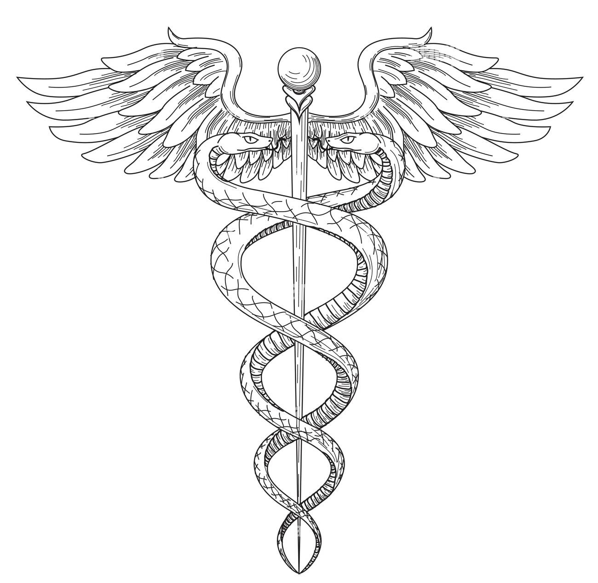

    Comision: "54140"
    Alumno: Farias Oscar
    Profesor: Acevedo Esteban
    Tutor: Romano Juan Manuel 

# Nombre de proyecto: "PortalMedic"

### Sobre el Proyecto:
    Éste proyecto está dirigido al personal Médico, en el cual dispondrá la posibilidad de llevar un registro único por paciente, donde podrá administrar de una manera simple las consultas o estudios realizados por el mísmo, ademas de tener su historia clínica para un mejor seguimiento.

### Objetivos:
    El médico/usuario de la aplicación contará con un sistema ordenado que le permitirá tener la información de forma rápida y sencilla, facilitando la tarea diaria sin la necesidad de tener que buscar la historia clínica de un paciente en papel.

### Mejoras Futuras:
    N\A

